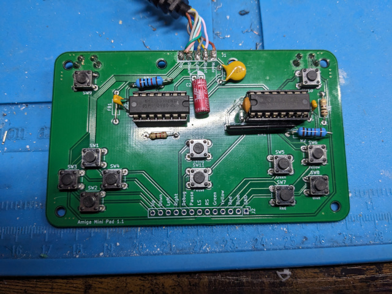
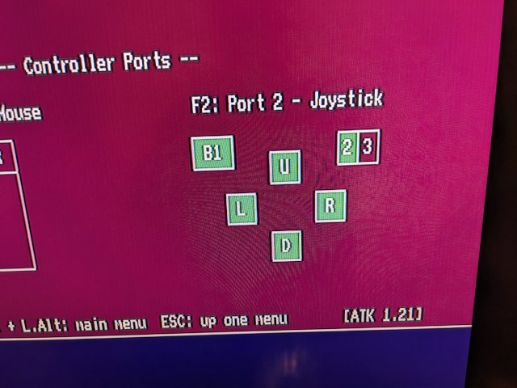
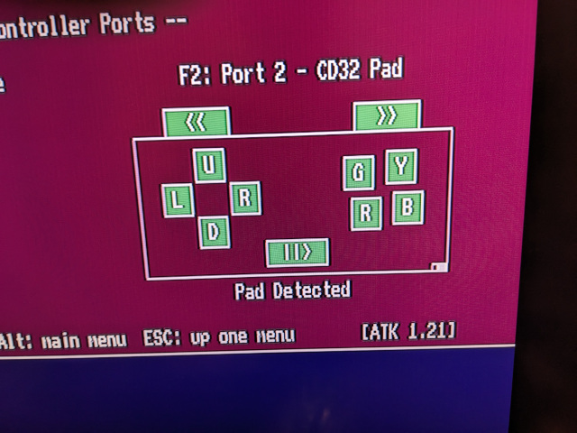

# AmigaPad
This is a copy of the schematic for the CD32 joypad from https://www.mrdictionary.net/PSCD32/diary/sites/CD32Gamepad_gerdkautzmann_de.html in KiCad, which is based on reverse engineered hardware.
I made a small PCB, which is mostly for testing and development work. So far I had no time to make a case for it.

I don't know what kind of Ferrite Bead the original Joypad uses, so I just put in a bridge. There is a choice of populating vertical buttons for the shoulder buttons, or plane horizontal on the face. The button
above the start button has no function in a normal Amiga software.

Classic Amiga software will see the directions, "red" as fire and "blue" as PotY.

CD32-compatible software will see the directions, four face buttons, two shoulder buttons and a start button.

You can preview the KiCad project on [KiCanvas](https://kicanvas.org/?repo=https%3A%2F%2Fgithub.com%2FJensRestemeier%2FAmigaPad%2Ftree%2Fmain%2FKiCad).
